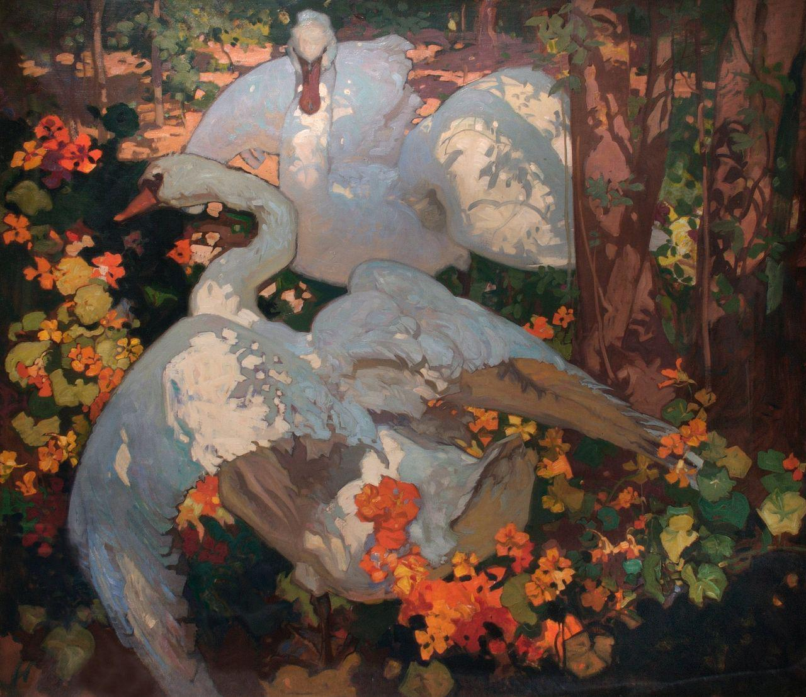
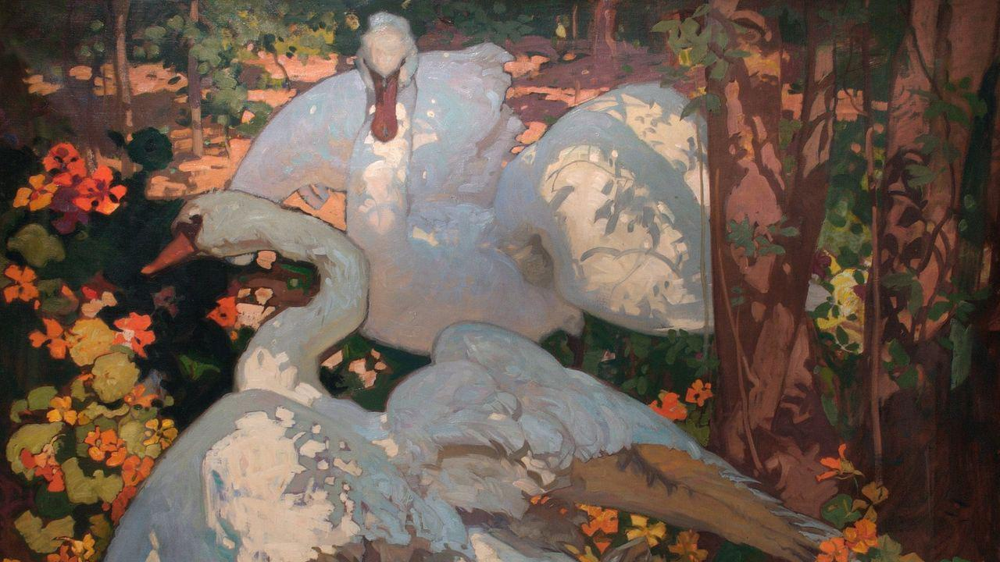
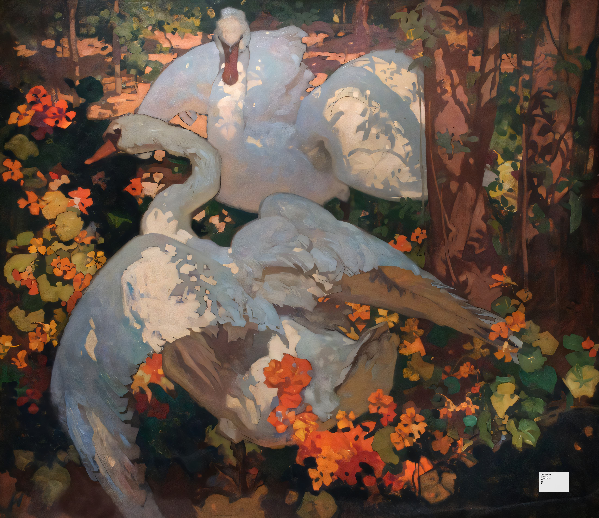

<p align="center">
  
  
  
  
  
</p>

# Neural Canvas

**Multi-agent vision AI pipeline that analyzes, interprets, and intelligently resizes artwork using coordinated AI specialists across 4 providers and 10+ models.**

---

## Teaching Machines to See Art the Way Curators Do

Resizing a painting is not the same as resizing a photograph. A center-crop that works fine on a smartphone selfie will bisect the focal subject of a Brangwyn composition or amputate the horizon line from a Monet landscape. Neural Canvas solves this by making the machine *understand what it is looking at* before it touches a single pixel.

The system orchestrates a **Research Agent** that fans out parallel queries to 7 vision models (Gemini 2.5 Pro, Grok-2 Vision, Llama 4 Maverick/Scout, Qwen 2.5 VL, InternVL3), then consolidates their findings through a dedicated reasoning model (Grok-3-mini) with explicit confidence scoring and art-historical date-range validation. That metadata -- artist, title, period, movement, genre -- drives the selection of a **genre-specialized Vision Agent** (one of 9 subclasses: landscape, portrait, religious/historical, surrealist, still life, animal, figurative, genre scene, or default) that applies domain-specific cropping logic using detected bounding boxes from Google Cloud Vision.

The result: a 16:9 crop that preserves compositional intent.

<p align="center">
  
  &nbsp;
  
  &nbsp;
  
</p>
<p align="center"><em>Frank Brangwyn, "Swans" (c.1921) — Original → Intelligent 16:9 crop → Museum placard overlay</em></p>

---

## Architecture

```
                          input/
                            |
                     +------+------+
                     | DocentAgent |  (Orchestrator)
                     +------+------+
                            |
              +-------------+-------------+
              |                           |
     +--------v--------+       +---------v---------+
     |  ResearchAgent   |       |    VisionAgent     |
     |  (7 models,      |       |  (Genre-specific   |
     |   parallel fan)  |       |   subclass)        |
     +--------+---------+       +---------+----------+
              |                           |
   +----------+----------+               |
   |  |  |  |  |  |  |   |               |
  Gem Grk Llm Qwn Int Mst               |
   |  |  |  |  |  |  |   |               |
   +----------+----------+               |
              |                           |
     +--------v--------+                 |
     |  Consolidation   |                 |
     |  (Grok reasoning)|                 |
     +--------+---------+                 |
              |                           |
              +-------------+-------------+
                            |
                  +---------v----------+
                  |   UpscaleAgent     |
                  | (Stability AI /    |
                  |  image-upscaling)  |
                  +---------+----------+
                            |
                  +---------v----------+
                  |   PlacardAgent     |
                  | (Museum-style      |
                  |  label overlay)    |
                  +---------+----------+
                            |
                        output/
```

---

## Technical Decisions

| Decision | Rationale |
|---|---|
| **Model-as-committee research** | A single vision model misidentifies artist or period roughly 30-40% of the time on lesser-known works. Querying 7 models concurrently via `ThreadPoolExecutor` and consolidating through a reasoning model with date-range cross-validation against a curated movement catalog produces reliable metadata. |
| **Genre-polymorphic vision agents** | Nine `VisionAgent` subclasses inherit from a shared abstract base with `BoundingBoxRegion` and `SegmentationMask` primitives. The DocentAgent dynamically selects the subclass based on research output, so a Monet landscape and a Caravaggio religious scene follow entirely different cropping logic. |
| **SSIM-based fidelity gates** | The `FidelityMetrics` module computes structural similarity, color histogram divergence, Laplacian detail preservation, and contrast-based emotional impact scores between original and processed images. Thresholds adjust per genre -- surrealist and abstract art tolerate more deviation than portraiture. |
| **Dual-backend upscaling** | Stability AI and image-upscaling.net as configurable primary/fallback, keeping the pipeline resilient to individual API outages. |
| **Card-stock placard overlay** | Museum-style labels rendered on a textured background image, positioned to avoid occluding key compositional elements, with metadata driven entirely by consolidated research output. |

---

## Tech Stack

| Layer | Technologies |
|---|---|
| **Orchestration** | Python 3.10+, YAML config, argparse CLI |
| **Vision Models** | Gemini 2.5 Pro, Gemini 2.0 Flash, Grok-2 Vision, Llama 4 Maverick/Scout, Qwen 2.5 VL 72B, InternVL3 14B, Mistral Small 3.1, Gemma 3 27B |
| **Reasoning** | Grok-3-mini-fast (consolidation + inter-agent thinking steps) |
| **APIs** | Google Generative AI, Vertex AI, xAI, OpenRouter, Stability AI, Google Cloud Vision |
| **Image Processing** | Pillow, OpenCV, NumPy, scikit-image (SSIM) |
| **Testing** | pytest (17 test modules), pytest-cov |

> [!NOTE]
> The Research Agent uses OpenAI-compatible client wrappers for both xAI (Grok) and OpenRouter endpoints, keeping the integration surface uniform across providers.

---

## Project Structure

```
neural-canvas/
  art_agent_team/
    agents/
      research_agent.py          # Multi-model parallel research + consolidation
      vision_agent_abstract.py   # Abstract base: BoundingBox, SegmentationMask
      vision_agent_landscape.py  # Google Cloud Vision object localization
      vision_agent_portrait.py   # Face/figure-aware cropping
      vision_agent_surrealist.py # Relaxed composition thresholds
      placard_agent.py           # Museum label generation
      upscale_agent.py           # Stability AI / image-upscaling.net
      ... (9 genre agents total)
    tests/                       # 17 test modules
    docent_agent.py              # Pipeline orchestrator
    fidelity_metrics.py          # SSIM, histogram, detail scoring
    main.py                      # CLI entry point
  input/                         # Source artwork + movements catalog
  docs/images/                   # Sample outputs
```

---

<details>
<summary><strong>Getting Started</strong></summary>

### Prerequisites

- Python 3.10+
- API keys for at least one vision provider (Google Gemini, xAI/Grok, or OpenRouter)
- Optional: Google Cloud Vision credentials (for bounding-box detection in genre agents)
- Optional: Stability AI key (for upscaling)

### Installation

```bash
git clone https://github.com/your-username/neural-canvas.git
cd neural-canvas

python -m venv .venv
source .venv/bin/activate
pip install -r requirements.txt
```

### Configuration

```bash
cp art_agent_team/config/config.yaml.example art_agent_team/config/config.yaml
# Edit config.yaml with your API keys
```

### Usage

```bash
# Full pipeline
python -m art_agent_team.main --input_folder input/

# The CLI presents stage selection:
#   1. Research (metadata extraction)
#   2. Vision (intelligent cropping)
#   3. Upscale (enhancement)
#   4. Placard (museum label)
#   5. Full workflow (all stages)

# Run tests
pytest art_agent_team/tests/ -v
```

</details>

<details>
<summary><strong>Supported Art Genres</strong></summary>

| Genre | Agent | Cropping Strategy |
|---|---|---|
| Landscape | `VisionAgentLandscape` | Horizon-line preservation via Cloud Vision object localization |
| Portrait | `VisionAgentPortrait` | Face/figure detection with compositional framing |
| Religious/Historical | `VisionAgentReligiousHistorical` | Multi-figure scene preservation |
| Surrealist | `VisionAgentSurrealist` | Relaxed thresholds for non-traditional composition |
| Still Life | `VisionAgentStillLife` | Object-group bounding box aggregation |
| Animal | `VisionAgentAnimal` | Subject-tracking with motion-aware framing |
| Figurative | `VisionAgentFigurative` | Body-proportion-aware cropping |
| Genre Scene | `VisionAgentGenre` | Multi-element narrative scene preservation |
| Default | `DefaultVisionAgent` | Center-weighted 16:9 fallback |

</details>

---

## License

MIT

---

<p align="center"><i>Treating every pixel with the respect the artist intended.</i></p>
